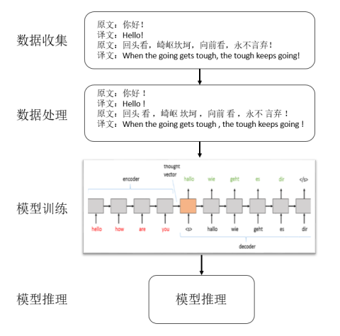

|  | 文档名称 | 文档密级 |
| :----------------------------------------------------------: | :------: | :------: |

# **微科研兴趣说明**-低资源机器翻译

- [**微科研兴趣说明**-低资源机器翻译](#微科研兴趣说明-低资源机器翻译)
  - [课题说明](#课题说明)
  - [数据信息](#数据信息)
    - [约束信息](#约束信息)
    - [数据情况](#数据情况)
  - [输出信息](#输出信息)
  - [交付件要求](#交付件要求)
  - [排分规则](#排分规则)

## 课题说明

​		机器翻译一般通过大量的原文和译文互译的语料作为输入数据，通过自然语言生成技术，如seq2seq这种encoder和decoder模型来训练这些数据，业界流行的Transformer架构就是这种模式，它也是现在机器翻译的SOTA模型。跟现在的很多深度学习模型一样，机器翻译对数据的依赖也非常大，一般我们将**百万级别以下的作为低资源**，百万及千万级别以上的语料规模作为中高资源。全世界的语言种类繁多，中高资源的语种只占了很少的比例，快速补充低资源语种的语料面临着很大的挑战。如何通过训练策略优化，模型优化来快速的提升低资源语种的质量，在机器翻译领域一直是研究的热点，也很具现实意义。机器翻译整体流程可以分成四步：

1. 整理和收集语料数据，准备好训练集，开发集和测试集。

2. 处理语料，包括去掉脏数据，分词，统计词表等；其中数据清洗尤其关键，可以是基于规则的数据处理，也有大量的基于模型的数据处理方法。

3. 模型训练，就是利用处理好的数据，进行模型训练，可以使用不用的训练框架，常用的机器翻译训练框架有TensorFlow的Tensor2Tensor也有Pytorch的FairSeq，还有基于TensorFlow的THUMT以及爱丁堡大学自己开发的纯C++版本Marian框架。

4. 模型推理，就是让训练好的模型，能够处理输入内容，通过模型转换成译文。

## 数据信息

### 约束信息

训练数据是[WMT21](http://statmt.org/wmt21/translation-task.html)的小语种祖鲁语（zu）-科萨语（xh）互译任务，只能使用WMT21官方提供的双语和单语数据。

### 数据情况

| 语种                   | 双语数据量 | 单语数据量           |
| ---------------------- | ---------- | -------------------- |
| zu-xh（祖鲁语-科萨语） | 102488     | Xh:1607722Zu:2079876 |

常用数据清洗工具[Fastalign](https://github.com/clab/fast_align)

常用分词器[SPM](https://github.com/google/sentencepiece)

## 输出信息

通过训练集和开发集找出最优的模型，然后提交测试集的机器翻译结果。输出结果每条数据翻译结果用过\n隔开，使用utf-8编码文件。

举例：

xh2zu语项，只用拿到xh2zu的测试集的xh部分，通过机器翻译得到zu的结果，提交zu结果。

zu2xh语项，只用拿到zu2xh的测试集的zu部分，通过机器翻译得到xh的结果，提交xh结果。

## 交付件要求

每个语项可以提交两个不同系统的结果，一个是主系统，一个是候选系统。

简要的描述数据处理，模型训练基本过程，以及通过dev调优的过程基本数据。

## 排分规则

提交系统的机器翻译结果，会最终和测试集的译文对比，计算Bleu值，得分高的胜出。
